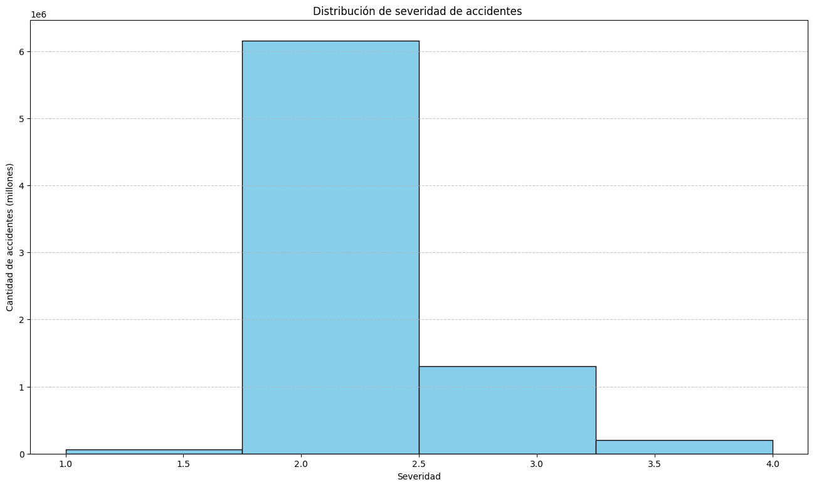
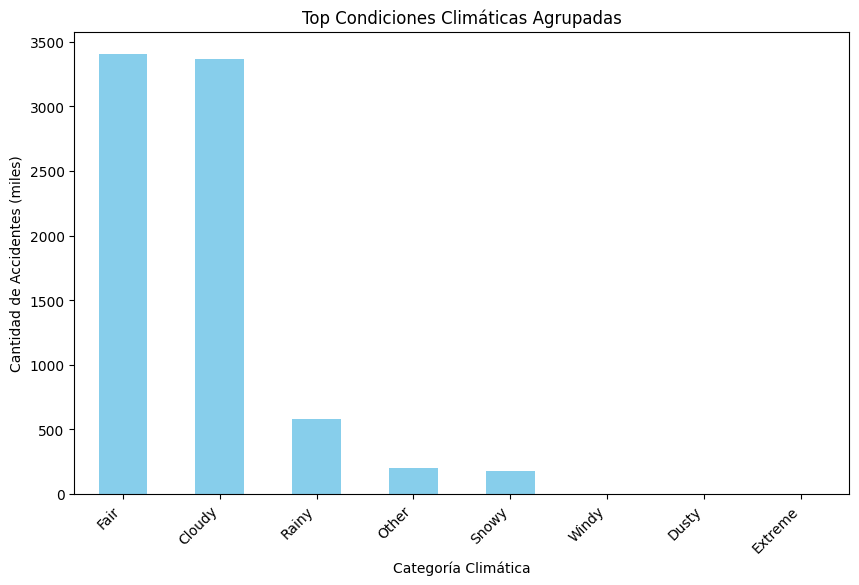
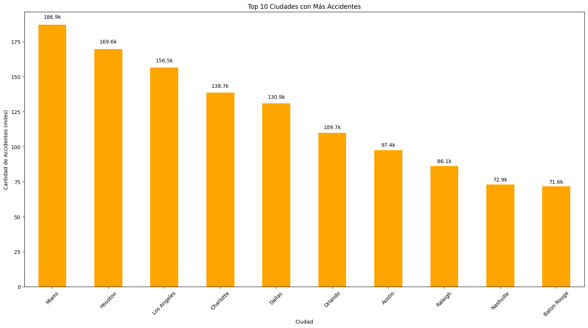
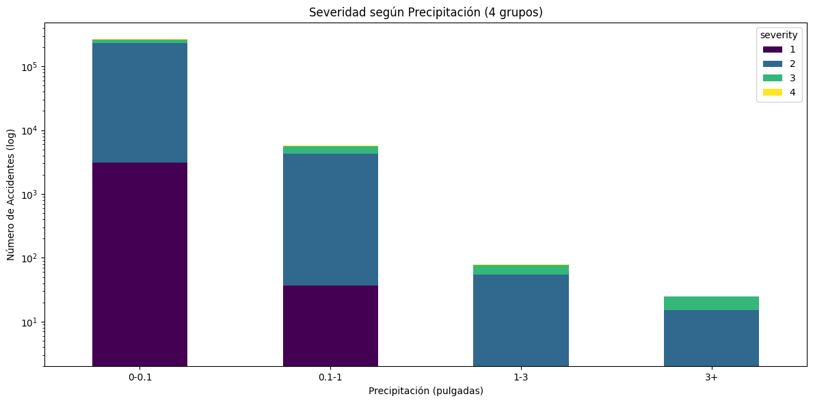
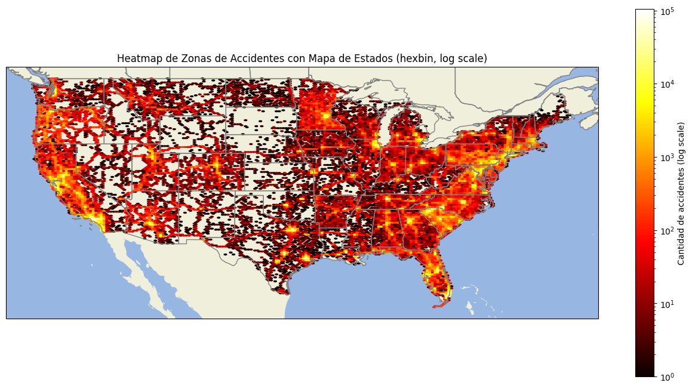
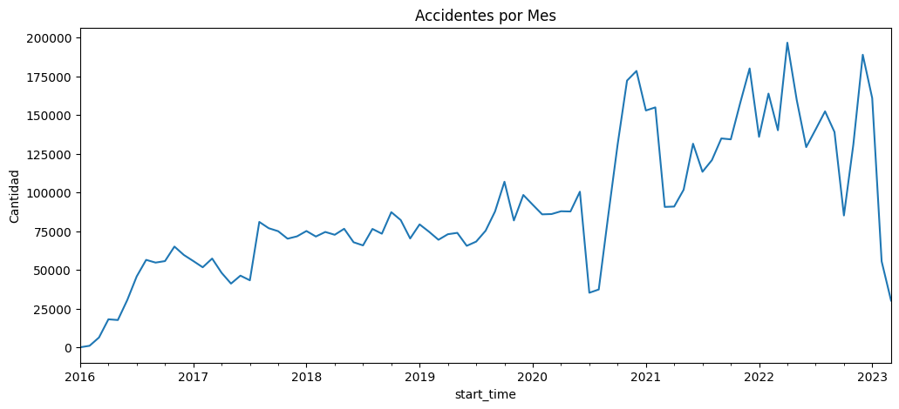
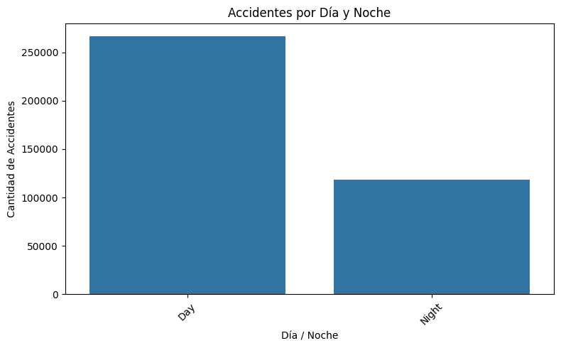
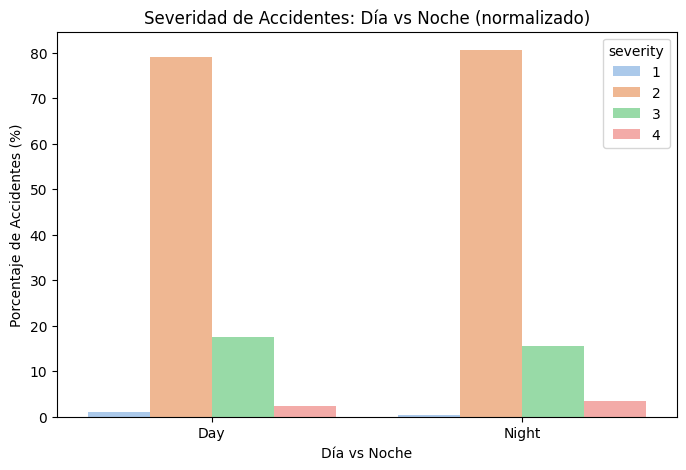
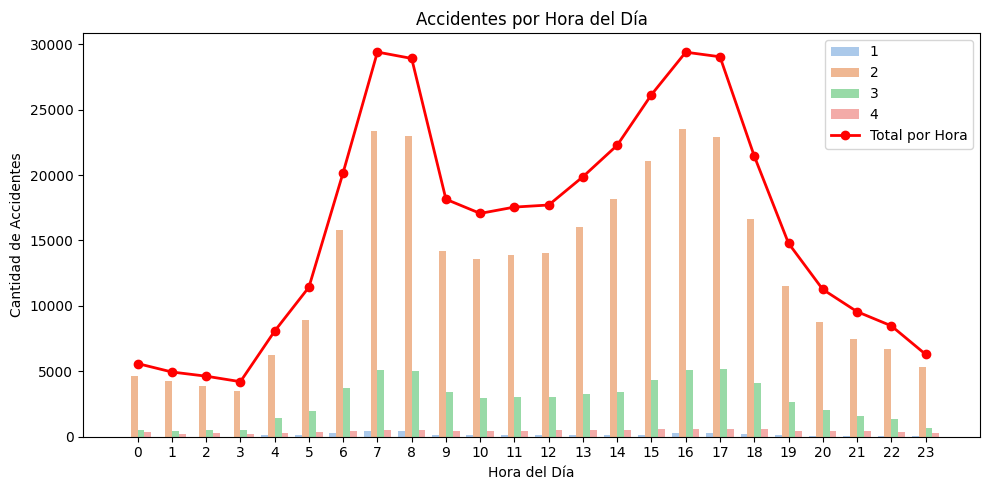

# Proyecto 1 Jose Buxo (EDA)

Disclaimer: El proyecto se hizo con un set de 2.4GB; al repo se subió un subset del dataset completo(por si hay diferencias en los graficos).

## Carga y Exploración del Dataset

La carga del dataset se realizó con la librería Polars, procesando los datos en chunks y luego concatenándolos en un DataFrame de pandas. Esto permitió manejar eficientemente el tamaño del archivo.

## Tipos de Datos
Tras la limpieza y normalización, los tipos de datos más relevantes son:

- Identificadores y texto: id, description, street, city, county, state, zipcode, weather_condition, wind_direction, sunrise_sunset.
- Números y medidas: severity, start_lat, start_lng, end_lat, end_lng, temperature(f), wind_chill(f), humidity(%), pressure(in), visibility(mi), wind_speed(mph), precipitation(in), distancia_afectada_km.
- Booleanos: amenity, bump, crossing, give_way, junction, no_exit, railway, roundabout, station, stop, traffic_calming, traffic_signal, turning_loop.
- Fechas y tiempos: start_time, end_time.

## Observaciones Iniciales

- Columnas como source, timezone, airport_code, weather_timestamp fueron eliminadas por no aportar valor directo al análisis.
- Los valores perdidos se concentran en columnas de GPS y mediciones meteorológicas, pero no afectan significativamente el análisis general.
- No se detectaron duplicados ni outliers graves.
- La granularidad del dataset permite un análisis a nivel de cada accidente individual.

## Limpieza y Normalización

- Se corrigieron tipos de datos para fechas.
- Se categorizaron las condiciones climáticas en categorías más sencillas.
- Columnas irrelevantes eliminadas: source, distance(mi), timezone, airport_code, weather_timestamp, civil_twilight, nautical_twilight, astronomical_twilight, country.

## Visualizaciones Básicas
### Distribución de Severidad

La severidad de accidentes se concentra principalmente en 2 y 3.

1 corresponde a los accidentes menos graves y 4 a los más graves.

Aproximadamente:

Severidad 1 -> 0.87%

Severidad 2 -> 79.67%

Severidad 3 -> 16.81%

Severidad 4 -> 2.65%

### Categorías Más Frecuentes

Las condiciones climáticas más frecuentes son:
1. Fair -> Buen clima (44.06%)

2. Cloudy -> Nublado (43.56%)

3. Rainy -> Lluvioso (7.47%)

Los accidentes bajo estas condiciones representan aproximadamente 95.09% del total.

### Zonas Principales De Accidentes
Las zonas mas comunes para accidentes son:
1. Miami -> ~189.6 mil accidentes

2. Houston -> ~169.6 mil accidentes

3. Los Angeles -> ~156.5 mil accidentes

### Severidad vs Precipitación

Los datos muestran que la severidad es discreta (1–4).

Se visualiza la distribución de severidad por rangos de precipitación mediante proporciones o gráficos apilados.

Observación general: los accidentes más graves tienden a aumentar ligeramente en rangos de precipitación más alta, y se ve una tendencia de crecimiento en severidad mientras que aumenta la precipitacion. Aun asi, la mayoría sigue concentrándose en los niveles intermedios de severidad (2-3). 

### Distribución Geoespacial

Las coordenadas de inicio (start_lat, start_lng) permiten identificar zonas con alta densidad de accidentes.

Esto es útil para análisis de prevención y planeamiento urbano, mostrando puntos críticos en carreteras o intersecciones.

En el diagrama se puede ver una vista mas abstracta de el pais entero. Se nota que las zonas de el es y oeste principalmente se concentran los accidentes. Se ve claramente que en zona populares como Florida(Miami) y California (San Francisco, Los Angeles, San Diego) y zonas como Washington, New York, Philadelphia, y Boston. Estos lugares son de alta densidad de populacion y freuqntes zonas de tourismo. Tambien Se ven puntos calientes en zonas como chicago, Menneapolis y Detroit.

## Conclusiones Exploratorias

Las condiciones climáticas más frecuentes con accidentes corresponden a: Buen clima, nublado, y lluvioso(en orden desendente).

La precipitación tiene un efecto leve sobre la severidad, pero no es determinante en la mayoría de los accidentes.

Las variables geoespaciales permiten identificar zonas críticas, y las variables de infraestructura vial.

En general, los datos están limpios, consistentes y listos para análisis más avanzados.

## Visualizaciones Adicionales
### Accidentes Por Mes
La cantidad de accidentes ha aumentado notablemente en los años más recientes (2021 en adelante).
También se observa una caída en los meses intermedios de 2020, probablemente relacionada con las cuarentenas por COVID en EE.UU.

### Accidentes Por Dia y Noche
Se observa que hay más accidentes durante el día que durante la noche.
Sin embargo, usando otra visualización, se aprecia que los accidentes nocturnos resultan más peligrosos.
Esto puede relacionarse con el estado mental del conductor y con menores niveles de tráfico, que dan pie a una conducción más rápida o riesgosa.

| Accidentes Por Día/Noche | Severidad Proporcional |
|---------------------------|-------------------------|
|  |  |

### Accidentes Por Horas
Se observan dos picos claros: entre las 7:00–8:00 y entre las 16:00–17:00.
Coinciden con horarios de entrada y salida de colegios y trabajos.
Además, la severidad baja en estos picos, lo cual sugiere que por congestión los accidentes ocurren a menor velocidad.

